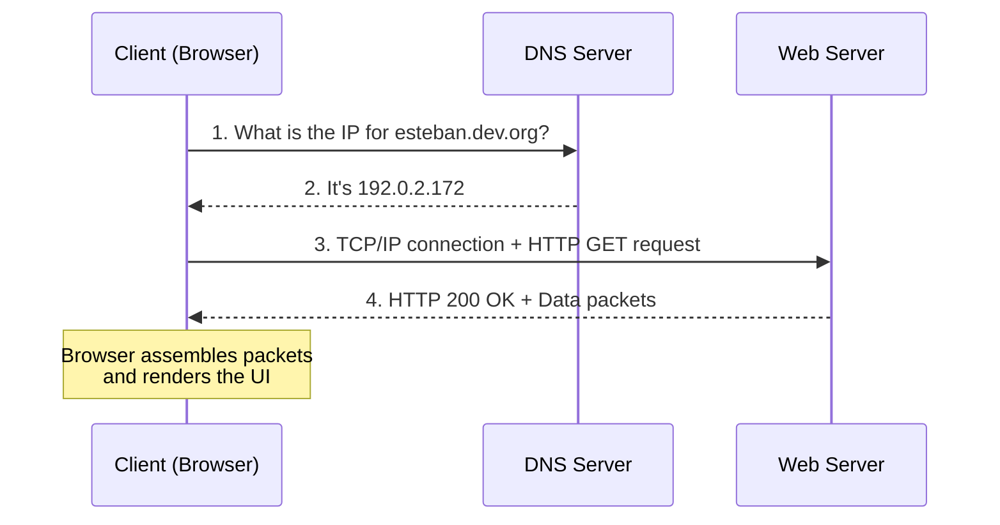

# How the web works

## Clients and servers


### What is a client?
Any internet-connected device or software (like your web browser) that reaches out to request data or resources from another point on the web.

### What is a server
A machine dedicated to storing webpages, sites, or apps. It listens for client requests and responds by sending back the required data, whether that's an HTML document, an image, or raw JSON.

### The third parties involved
To make this back-and-forth communication possible, several underlying technologies and protocols must work together:
- Internet connection: The physical or wireless infrastructure that allows data transmission between your device and the outside world.
- Transmission Control Protocol and Internet Protocol (TCP and IP respectively): The fundamental rules defining how data is packaged and routed across the internet to ensure it reaches its destination.
- The Domain Name System (DNS): The internet's address book. It translates human-readable domain names into the machine-readable IP addresses where the servers actually live.
- Hypertext Transfer Protocol (HTTP): The common language clients and servers use to understand each other's requests and responses.
- Files: The actual content being served, typically divided into code (HTML, CSS, JavaScript for the browser to render) and assets (media, images, fonts).

### The communication process
When you enter a URL into your browser, a rapid chain of events takes place behind the scenes:

1. DNS lookup: The browser queries the DNS to find the exact IP address associated with the domain name you typed.
2. The request: Using TCP/IP routing, the browser sends an HTTP request message to that specific server, asking for the website's files.
3. The response:If everything is correct and accessible, the server replies with a success message (like `200 OK`) and begins transmitting the data back as a stream of small data packets.
4. Rendering: The browser receives these packets, reassembles them, and interprets the code to display the visual web page on your screen.



### DNS breakdown
While humans use memorable strings like developer.mozilla.org to navigate the web, computers rely on IP addresses (like 192.0.2.172) to identify exact locations on the network. Since remembering random strings of numbers is highly impractical, the Domain Name System (DNS) was created to bridge the gap.

It acts as a massive registry that links a human-friendly URL to its corresponding IP address. For massive, globally distributed websites, a single domain name might even point to different IP addresses depending on where the user is geographically located, ensuring faster load times.

### Packets
Data isn't sent across the web as one massive file; instead, it is chopped up into small, manageable chunks called packets. Every single packet carries:

- A header: Containing routing metadata like the sender and receiver IP addresses, the specific packet number, and the total sequence count.
- A payload: The actual fragment of data being transported.

This fragmentation is crucial for network efficiency. If a packet gets corrupted or lost in transit, the client only needs to re-request that tiny specific chunk rather than downloading the entire file from scratch. It also allows packets to take different optimal routes across the network and be perfectly reassembled upon arrival using their header information.

### HTTP
HTTP relies on a simple set of verbs to define the action the client wants to perform. The most common is GET, which simply asks the server to retrieve and send a resource.

Here is what a typical request looks like:
```http
GET /en-US/ HTTP/2

Host: esteban.dev.org
```

And here is the server's typical response:
```http
HTTP/2 200
date: Wed, 19 Aug 2026 11:13:30 GMT
expires: Wed, 19 Aug 2026 11:40:01 GMT
server: Google frontend
last-modified: Tue, 11 Feb 2025 00:49:32 GMT
ETag: "65f26b7f6463e2347f4e5a7a2adcee54"
content-length: 45227
content-type: text/html

<!doctype html> ... (the 45227 bytes of the requested web page HTML)
```

- `HTTP/2 200`: This indicates the protocol version used (HTTP/2) followed by the status code. 200 means the request was completely successful ("OK").
>[!note]
> Other common codes include 301 for moved resources, 400 for bad formatting, 403 for forbidden access, 404 for missing resources, and 503 for server downtime

- `date`, `server`, `content-type`: These are HTTP Headers. They provide the browser with critical metadata about the response, such as when it was sent, what kind of server processed it, and what type of file is attached.

- `<!doctype html>...`: This is the actual response body. It contains the payload—in this case, the raw HTML code that the browser will read to build the visual interface.

---

Reference: [How the web works](https://developer.mozilla.org/en-US/docs/Learn_web_development/Getting_started/Web_standards/How_the_web_works#clients_and_servers)
