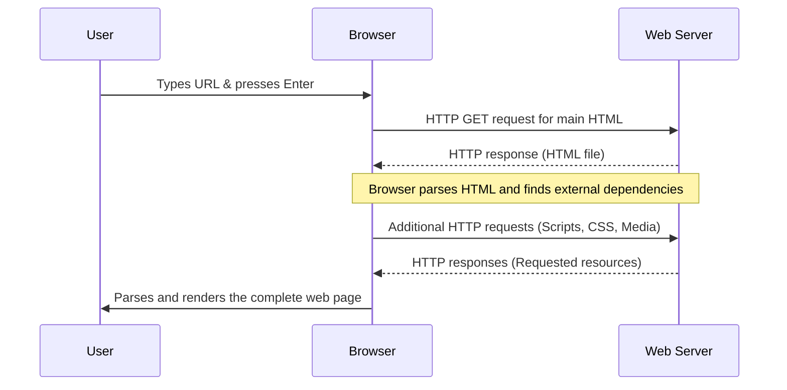

# The difference between web page, website, web server, and search engine

1. Web page
  A document written in the HTML language that can be displayed in a web browser. These are also often called just "pages". 
2. Website
  A collection of web pages grouped together into a single resource, with links connecting them together. Often called a "site".
3. Web server
  A computer that hosts a website on the internet.
4. Web service
  A software that responds to requests over the Internet to perform a function or provide data. A web service is typically backed by a web server, and may provide web pages for users to interact with.
5. Search engine
  A web service that helps you find other web pages, such as the goat DuckDuckGo.

## How the web works
When you interact with the web, a specific sequence of events occurs between the browser and the remote server
- The web browser requests a resource (like a web page or data) from the web server where it is stored.
- This communication happens via HTTP (Hypertext Transfer Protocol), which uses verbs like `GET` to describe the intended action.
- If the request is successful, the web server sends an HTTP response containing the requested resource back to the browser.
- Upon receiving the initial HTML file, the browser parses it and often triggers additional HTTP requests for embedded resources, such as scripts, style information, and media.
- Once all resources are received, the browser parses and renders them to display the final result.

Reference: [Browsing the web](https://developer.mozilla.org/en-US/docs/Learn_web_development/Getting_started/Environment_setup/Browsing_the_web)

