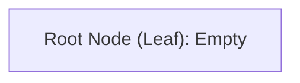
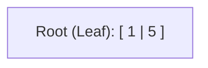
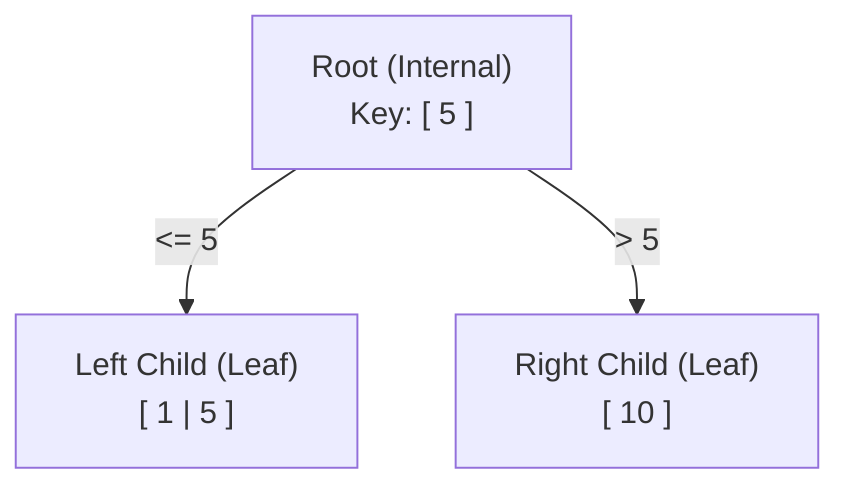
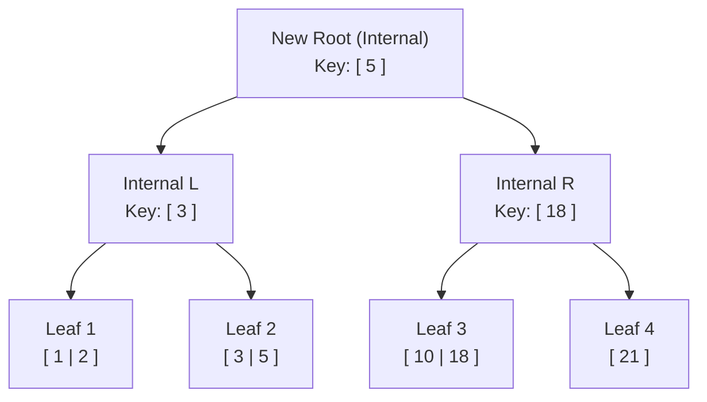

# Part 7: The B-Tree
Up until now, the tutorial's implementation has stored data in a flat, unorganized array of pages. While this works for tiny amounts of data, it's terrible for real-world databases. To fix this, the next step in the tutorial is to transition the database storage to use a **B-Tree** (specifically a **B+ Tree**). 

This part is purely theoretical to help wrap my head around the core concepts before diving into the C code provided in the next lessons.

---

## What exactly is a B-Tree?
The "B" in B-Tree doesn't have an official meaning. It probably stands for the inventor's name (Rudolf Bayer), but it's often thought of as standing for **"Balanced"** or **"Broad"** tree.

Unlike a standard Binary Tree where each node can only have a maximum of 2 children (left and right), a B-Tree is *broad*. Each node can have up to $m$ children, where $m$ is called the **"order"** of the tree. 

To keep the tree perfectly balanced and guarantee fast operations, B-Trees enforce a few strict rules:
1. **Capacity Limits:** A node can have up to $m$ children and $m - 1$ keys.
2. **Minimum Occupancy:** To prevent the tree from becoming too tall and sparse, internal nodes must be at least half full (minimum $m/2$ children).
3. **Exceptions:** * Leaf nodes have 0 children.
   * The root node is allowed to have fewer than $m/2$ children (but if it's an internal node, it must have at least 2).

### Why Trees for Databases?
Using a balanced tree structure is essential for databases because it provides a massive performance boost over flat arrays:
* **Fast Searches:** Finding a specific value takes logarithmic time $O(\log n)$.
* **Fast Inserts/Deletes:** The strict rebalancing rules keep insertion times relatively constant.
* **Fast Range Queries:** Because the data is kept in sorted order, traversing a range of values (e.g., `WHERE id > 10 AND id < 50`) is extremely efficient.

---

## B-Tree vs. B+ Tree
SQLite actually uses two variations of the B-Tree. Here is a breakdown of the differences to understand the tutorial's design choices:

| Feature | B-Tree ("Bee Tree") | B+ Tree ("Bee Plus Tree") |
| :--- | :--- | :--- |
| **What SQLite uses it for** | Storing **Indexes** | Storing **Tables** |
| **Internal nodes store Keys?** | Yes | Yes |
| **Internal nodes store Values?** | Yes | **No** (Only for routing) |
| **Number of children per node** | Less | More (because no values take up space) |
| **Structure difference** | Internal and Leaf are the same | Internal and Leaf nodes are completely different |

> **Note:** For the implementation of tables in this tutorial, we will be studying a **B+ Tree**, but like the SQLite docs, it is often casually referred to as just a "btree".

---

## Node Anatomy in the B+ Tree

Because we are building a B+ Tree, internal nodes and leaf nodes have entirely different jobs and are structured differently in memory:

| Property | Internal Node | Leaf Node |
| :--- | :--- | :--- |
| **What it stores** | Keys and Pointers to children | Keys and actual Values (Row data) |
| **Max Keys** | $m - 1$ | As many as will fit in a page |
| **Number of Pointers** | Keys + 1 | None |
| **Number of Values** | None | Same as number of keys |
| **Purpose of Keys** | Routing traffic left or right | Paired with the actual row value |

---

## Visualizing the Tree Growth (Order-3 Example)

To understand the math behind the splits, here is a visualization of an **Order-3** tree. This means:
* Max 3 children / Max 2 keys per internal node.
* Min 2 children / Min 1 key per internal node (to keep it balanced).

1. The Empty Tree
  An empty tree starts as a single root node that acts as an empty leaf.

2. Inserting the first keys
  When the first few records are inserted, they simply go into the leaf node in sorted order. Let's assume this leaf node reaches its capacity of 2 items.

3. The first split (2 levels)
  When a 3rd record is inserted (like `10`), the leaf is completely full. The system has to split the leaf into two halves. A new internal node is created to act as the new Root, which holds a routing key (`5`) and pointers to the two child leaves.
  - Rule : Look up $\leq 5$? Go left. Look up $> 5$? Go right.

5. Splitting the root (3 levels)
  As more keys like `18` and `21` are added, eventually the internal root node will run out of space for routing keys. When the internal node is full, the root itself splits. A brand new root is created above them, increasing the depth of the entire tree by 1.

>[!note] Key takeaway
> The depth of the tree only increases when the root node splits, Because of this, every single leaf node will always be at the exact same depth, guaranteeing that the tree remains perfectly balanced.
