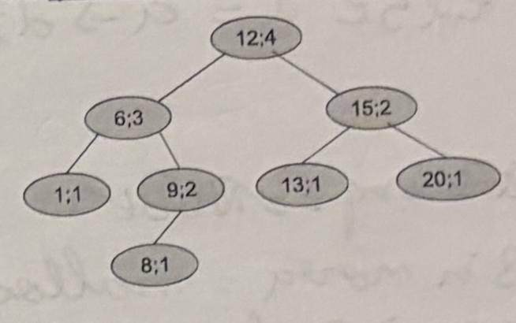

# 1. Strings (3 valores) 
Defina uma função `int capitaliza (char txt[])` que, dada uma string onde está armazenada um texto, substitui a primeira letra de cada palavra pela correspondente letra maiúscula. Considere que uma palavra começa numa letra que está no inicio da string ou imediatamente após um espaço. Por exemplo, se a string for "Muito bom dia" a função deve transformá-la em "Muito Bom Dia". A função deve retornar o número de caracteres alterados.

```c title:"A minha solução (1,5 valores)"
int capitaliza (char txt[]){
	int i = 1, s = strlen(txt) - 1, conta = 0;
	for (; i < s; i++){
		if(txt[i] == ' '){
			txt[i++] += 32;
			conta ++;
		}
	}
	return conta;
}
```

```c title:"Correção"
int capitaliza(char txt[]){
	int i = 0; s = strlen(txt) - 1, conta = 0;
	for(; i < s; i++){
		if(txt[i] == ' ' && txt[i +  1] > 'a' && txt[i + 1] <= 'z')
		txt[i + 1]-= 32;
		conta ++;
	}
	return conta;
}
```

# 2. Arrays (3 valores)
Defina uma função `int maxSomaK (int a[], int N, int k)` que, dado um array `a` com `N` elementos e um número `k` $(1 \leq k \leq N)$, calcula a máxima soma que é possível obter com `k` elementos consecutivos do array. Por exemplo, para o array `{1, 3, -1, 7, 5, -2, 8, 3, 4}` com 10 elementos, a invocação da função para `4 = 4` como resultado 14 correspondendo à soma dos elementos {5, -2, 8, 3}

```c title:"A minha solução (1 valor)" 
int maxSomaK(int a[], int N, int k){
	int r = 0, soma = 0;
	for(int i = 0; i < N; i++){
		soma = 0;
		for(int j = 0; j < k; j ++){
			soma += v[(i + j) % N]; 
		}
		if(soma > r) r = soma;
	}
	return soma;
}
```

```c title:"Correcção"
int maxSomaK(int a[], int N, int k){
	int r = -999999;
	int soma;
	for(int i = 0; i <= N - k; i++){
		soma = 0;
		for(int j = 0; j < k; j++) soma += a[i + j];
	}
	if (soma > r) r = soma;
	return r;
}
```

# 3. Ordenação de arrays (2 + 2 = 4 valores)
## 1.
Defina a função `int mergeSemRep(int a[], int na, int b[], int nb, int r[])` que, dados dois arrays ordenados sem repetições (`a` com `na` elementos e `b` com `nb` elementos) preenche o array `r` com os elementos dos arrays `a` e `b`, ordenado por ordem crescente e sem repetições. A função retorna o número de elementos que foram escritos em `r`.

```c title:"A minha solução (1,5 valores)"
int mergeSemRep(int a[], int na, int b[], int nb, int r[]){
	int ia = 0, ib = 0;
	for(int i = 0; ia < na && ib < nb; i++){
		if(a[ia] <= b[ib]){
			r[i] = a[ia];
			ia++;
			i++;
		} else {r = b[ib]; ib++; i++;}
	} i++;
	if(ia < na){
		while(i < na){r[i++] = a[na++];}
	}
	else {while(ib < nb){r[i++] = b[nb++];}}
	return i;
}
```

```c title:"Correção"
int mergeSemRep(int a[], int na, int b[], int nb, int r[]){
	int ia = 0, ib = 0, ir = 0;
	while(ia < na && ib < nb){
		int menor;
		if (a[ia] < b[ib]) menor = a[ia++];
		else if (b[ib] < a[ia]) menor = b[ib++];
		else { 
			menor = a[ia++]; 
			ib++; 
        }
		if(ir == 0 || r[ir - 1] != menor) r[ir++] = menor;
	}
	while(ia < na){
		if(ir == 0 || r[ir - 1] != a[ia]) r[ir++] = a[ia];
		ia++;
	}
	while(ib < nb){
		if(ir == 0 || r[ir - 1] != b[ib]) r[ir++] = b[ib];
		ib++;
	}
	return ir;
}
```

## 2.
Defina uma função `int mSort(int v[], int N)`, uma variante da função `mergeSort` estudada, que ordena um array de `N` inteiros retirando as repetições.
A função deve retornar o número de elementos.

```text title:"No answer (0 valores)" 
```

```c title:"Solução"
int mSort(int v[], int N){
	if(N < 2) return N;
	int meio = N / 2;
	int tamEsq = mSort(v, meio);
	int tamDir = mSort(v + meio, N - meio);
	int *temp = malloc((tamEsq + tamDir) * sizeof(int));
	int novoTamanho = mergeSemRep(v, tamEsq, v + meio, tamDir, temp);
	for(int i = 0; i < novoTamanho; i++) v[i] = temp[i];
	free(temp);
	return novoTamanho;
}
```

# 4. Lista ligadas (3 valores)
Defina uma função `int contido(int v[], int N, LInt l)` que dado um array `v` com `N` elementos (ordenado e sem repetições) e uma lista ordenada `l`, testa se todos os elementos do array existem na lista. A função deve retornar `1` se todos os elementos de `v` existem na lista `l`, e `0` caso contrario.

```c title:"Lista ligada struct"
typedef struct no{
	int valor;
	struct no *prox;
} *LInt;
```

```c title:"A minha solução (1 valor)"
int contido(int v[], int N, LInt l){
	for(int i = 0; i < N; i++){
		int flag = 1;
		while(!flag){
			if(v[i] == l->valor) flag = 0;
			else if(v[i] < a->valor) return 0;
			else l = l->prox;
		}
	}
	return 1;
} 
```

```c title:"Correção"
int contido(int v[], int N, LInt l){
	int i = 0;
	while(i < N && l != NULL){
		if(v[i] == l->valor) i++;
		else if(v[i] > l->valor) l = l->prox;
		else return 0;
	}
	return (i == N) ? 1 : 0;
}

```

# 5. Lista ligadas (4 valores)
Defina uma função `int removeMuitos(LInt *l, int v[], int N)` que retira da lista `*l` os elementos que estão no array `v`. Assuma que tanto a lista como o array estão ordenados e que o array não tem elementos repetidos. A função deve devolver o número de elementos removidos.

```c title:"A minha solução (2,5 valores)"
int removeMuitos(LInt *l, int v[], int N){
	int conta = 0;
	for(int i = o; i < N; i++){
		while(*l != NULL){
			*l = (*l)->prox;
			conta++;
		}
		l = &((*l)->prox);
	}
	return conta;
}
```

```c title:"Correção"
int removeMuitos(LInt *l, int v[], int N){
	int conta = 0, i = 0;
	while(*l != NULL && i < N){
		if((*l)->valor < v[i]) l = &((*l)->prox);
		else if((*l)->valor == v[i]){
			LInt temp = *l;
			*l = (*l)->prox;
			free(temp);
			conta++;
		}
		else i++;
	}
	return conta;
}
```

# 6. Árvores binárias (3 valores)
Relembre a definição (recursiva) da função `ABin insere(ABin a, int x)` de inserção de um elementos numa árvore binária de procura. Considere agora que em cada nodo das árvores é ainda armazenada a altura da árvore que se inicia (i.e., que tem raiz) nesse nodo. A árvore em baixo exemplifica uma destas árvores (em cada nodo aparece `valor; altura`)
Adapte a função de inserção de um novo elementos para esta nova definição de árvores binárias de procura. Note que esta inserção pode ter que alterar a informação (campo `altura`) de alguns nodos da árvore. Por exemplo, a inserção de 10 não altera os outros nodos da árvore. Por outro lado, a inserção de 7 irá alterar a informação de 4 dos nodos da árvore (12, 6, 9 e 8).

<!--  -->
![[arvore.png]]

```c title:"Árvore struct"
typedef struct abin{
	int valor;
	int altura;
	struct abin *esq, *dir;
} *ABin;
```

```c title:"A minha resolução (0.5 valores)"
void restaAltura(ABin a){
	if(a != NULL) a->altura --;
	restaALtura(a->esq);
	restaAltura(a->dir);
}
ABin insere(ABin a, int x){
	ABin aux = a;
	while(a->esq != NULL && a->dir != NULL){
		if(x < a->valor){
			a = a->esq;
		}
		else a = a->dir;
	}
	ABin nova = malloc(sizeof(struct abin));
	nova->valor = x;
	nova->esq = NULL; 
	nova->dir = NULL;
	nova->altura = (a->altura) - 1;
	(a->esq == NULL) ? (a->esq = nova) : (a->dir = nova);
	if(nova->altura == 1){
		nova->altura++;
		restaAltura(aux);
	}
	return aux;
}
```

```c title:"Correção"
ABin insere(ABin a, int x){
	if(a == NULL){
		ABin nova = malloc(sizeof(struct abin));
		nova->valor = x;
		nova->altura = 1;
		nova->esq = NULL;
		nova->dir = NULL;
		return nova;
	}
	if(x < a->valor) a->esq = insere(a->esq, x);
	else if(x > a->valor) a->dir = insere(a->dir, x);
	else return a;
	int altEsq = (a->esq != NULL) ? a->esq->altura : 0;
	int altDir = (a->dir != NULL) ? a->dir->altura : 0;
	a->altura = 1 + ((altEsq > altDir) ? altEsq : altDir);
	return a;
}
```
