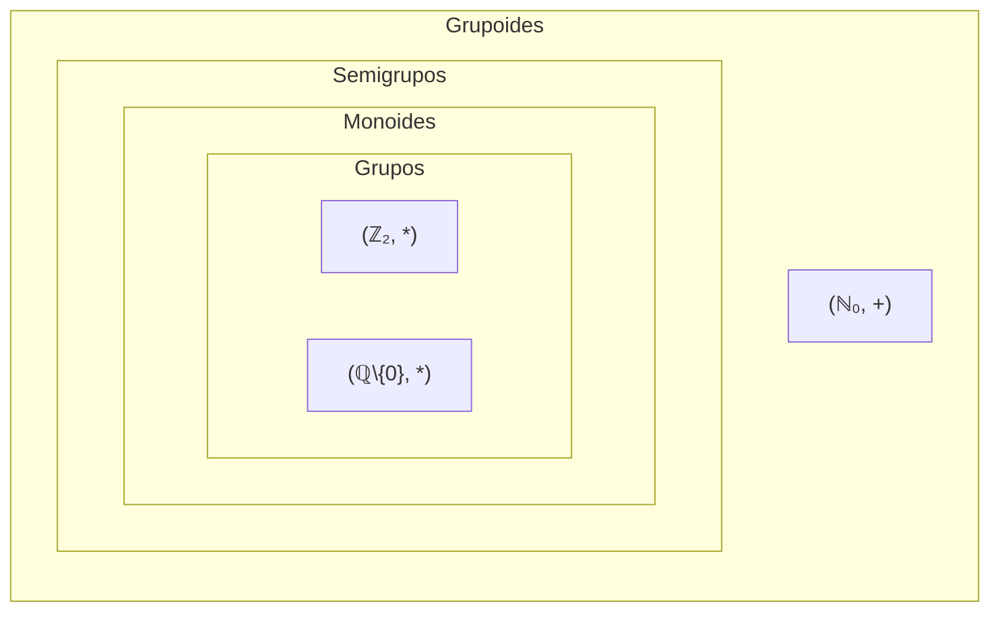

# Elementos da teoria de grupos

## 1.1 Grupóides, semigrupos e Monoides

$\textbf{Definição 1.1.1}$ Seja $X$ um conjunto. **Uma operação binária** (interna) em X é uma função $*: X \times X \to X \text{, } \, (x, y) \mapsto x * y$. Uma operação binária $*$ em $X$ diz-se:
- **Associativa** se para cada três elementos $x, y, z \in X \text{, } \, (x*y)*z = x * (y * z).$
- **Comutativa** se para cada dois elementos $x, y \in X \text{,} \, x * y = y * x$.

$\textbf{Exemplo 1.1.2}$ 
- (i) A adição $+$ e a multiplicação $\cdot$ são operações associativas e comutativas em $\mathbb{N}, \, \mathbb{Z}, \, \mathbb{Q}, \, e \, \mathbb{R}$.
- (ii) A substração $-$, não sendo nem associativa nem comutativa, é uma operação binária em $\mathbb{Z}$, $\mathbb{Q}$, e $\mathbb{R}$, mas não em $\mathbb{N}$.
- (iii) $a*b = |a - b|$ em $\mathbb{N}$ é comutativa mas não associativa.
- (iv) A multiplicação das matrizes é uma operação associativa no conjunto $\mathcal{M}_{n \times n}(\mathbb{R})$. Se $n \leq 2$, então a multiplicação não é comutativa. 
- (v) A composição de funções é uma operação associativa no conjunto $\mathcal{F}(X)$ das funções no conjunto $X$. Se $X$ tiver pelo menos dois elementos, a composição não é comutativa.
- (vi) A reunião e a intersecção são operações associativas e comutativas no conjunto potências $\mathcal{P}(X)$ de um conjunto $X$.

$\textbf{Nota}$. Uma operação binária $*$ num conjunto finito $X = \{x_1,\dots,x_n\}$ pode ser dad através de uma tabela da forma:

|  | $x_1$ | $x_2$ | ⋯ | $x_j$ | ⋯ | $x_n$ |
| :--- | :--- | :--- | :--- | :--- | :--- | :--- |
| $x_1$ | $x_1 * x_1$ | $x_1 * x_2$ | ⋯ | $x_1 * x_j$ | ⋯ | $x_1 * x_n$ |
| $x_2$ | $x_2 * x_1$ | $x_2 * x_2$ | ... | $x_2 * x_j$ | ⋯ | $x_2 * x_n$ |
| ⋮ | ⋮ | ⋮ | ⋮ | ⋮ | ⋮ | ⋮ |
| $x_i$ | $x_i * x_1$ | $x_i * x_2$ | ... | $x_i * x_j$ | ... | $x_i * x_n$ |
| ⋮ | ⋮ | ⋮ | ⋮ | ⋮ | ⋮ | ⋮ |
| $x_n$ | $x_n * x_1$ | $x_n * x_2$ | ... | $x_n * x_j$ | ... | $x_n * x_n$ |

Esta tabela chamada **tabela de Cayley** representa a operação $*$ no conjunto $X$.
$\textbf{Exemplo}$. A tabela de Cayley da reunião no conjunto potência de um conjunto $X$ com um elemento é dada por:

|             | $\emptyset$ | $X$ |
| ----------- | ----------- | --- |
| $\emptyset$ | $\emptyset$ | $X$ |
| $X$         | $X$         | $X$ |

$\textbf{Definição}$. Um **grupóide** é
