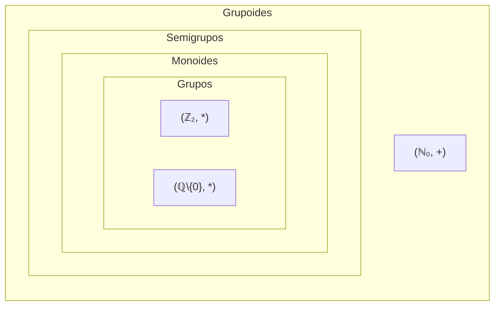

# Elementos da teoria de grupos

```mermaid
flowchart TD
    subgraph Grupoides
        direction TB
        N["(ℕ₀, +)"]
        subgraph Semigrupos
            subgraph Monoides
                subgraph Grupos
                    G1["(ℤ₂, *)"]
                    G2["(ℚ\{0}, *)"]
                end
            end
        end
    end
```

