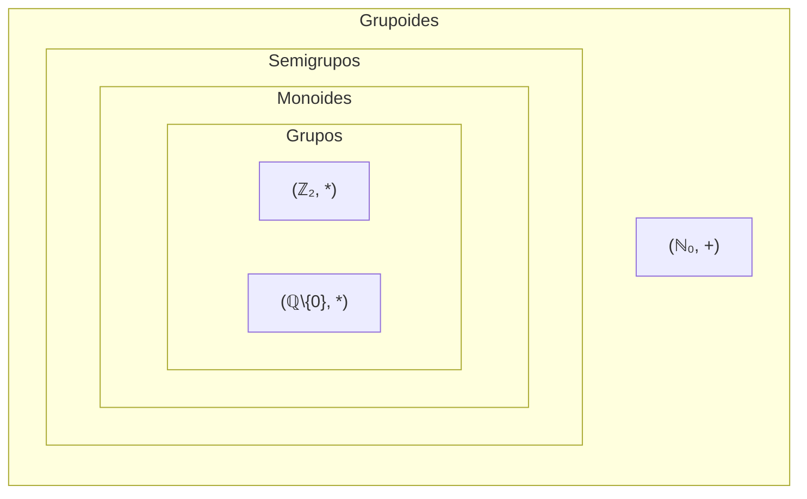

# Elementos da teoria de grupos — Aula 1 (16/09)

## 1. Grupóides e Semigrupos

### Operação binária

$\textbf{Definição}$. Seja $X$ um conjunto. **Uma operação binária** (interna) em $X$ é uma função $*: X \times X \to X \text{, } \, (x, y) \mapsto x * y$. Uma operação binária $*$ em $X$ diz-se:
- **Associativa** se para cada três elementos $x, y, z \in X \text{, } \, (x*y)*z = x * (y * z).$
- **Comutativa** se para cada dois elementos $x, y \in X \text{,} \, x * y = y * x$.

$\textbf{Exemplo}$ 
- (i) A adição $+$ e a multiplicação $\cdot$ são operações associativas e comutativas em $\mathbb{N}, \, \mathbb{Z}, \, \mathbb{Q}, \, e \, \mathbb{R}$.
- (ii) A subtração $-$, não sendo nem associativa nem comutativa, é uma operação binária em $\mathbb{Z}$, $\mathbb{Q}$, e $\mathbb{R}$, mas não em $\mathbb{N}$.
- (iii) $a*b = |a - b|$ em $\mathbb{N}$ é comutativa mas não associativa.
- (iv) A multiplicação das matrizes é uma operação associativa no conjunto $\mathcal{M}_{n \times n}(\mathbb{R})$. Se $n \geq 2$, então a multiplicação não é comutativa.
- (v) A composição de funções é uma operação associativa no conjunto $\mathcal{F}(X)$ das funções no conjunto $X$. Se $X$ tiver pelo menos dois elementos, a composição não é comutativa.
- (vi) A reunião e a intersecção são operações associativas e comutativas no conjunto potências $\mathcal{P}(X)$ de um conjunto $X$.

### Grupóide

$\textbf{Definição}$. Um **grupóide** é um par $(X, *)$ em que $X$ é um conjunto não vazio e $*$ é uma operação binária em $X$.
- $X$ é chamado o **conjunto suporte** do grupóide.
- O grupóide diz-se **finito** ou **infinito** conforme o conjunto $X$ o seja. No caso finito, o cardinal de $X$ diz-se a **ordem** do grupóide, e representa-se por $|X|$.
- Habitualmente dizemos "o grupóide $X$", em vez de $(X,*)$, quando a operação estiver subentendida.
- O grupóide $(X,*)$ diz-se **comutativo** se $*$ é comutativa, e **associativo** se $*$ é associativa.

$\textbf{Exemplo}$
1. $(\mathbb{R}, *)$ onde $*$ é a multiplicação usual em $\mathbb{R}$.
2. $(\mathbb{Z}, +)$, $(\mathbb{Z}, -)$, $(\mathbb{Z}, \cdot)$ são as operações usuais da adição, subtração e multiplicação.
3. **Não** são grupóides: $(\mathbb{Z}, /)$ (a divisão usual não é uma operação binária *interna* em $\mathbb{Z}$), $(\mathbb{N}, -)$ (a subtração pode sair de $\mathbb{N}$).

### Tabela de Cayley

Um grupóide $(X, *)$ finito pode ser identificado por uma **tabela de Cayley**:

|            | $x_1$ | $x_2$ | ⋯ | $x_j$ | ⋯ | $x_n$ |
| ---------- | ----- | ----- | - | ----- | - | ----- |
| $x_1$      | $x_1*x_1$ | $x_1*x_2$ | ⋯ | $x_1*x_j$ | ⋯ | $x_1*x_n$ |
| $x_2$      | $x_2*x_1$ | $x_2*x_2$ | ⋯ | $x_2*x_j$ | ⋯ | $x_2*x_n$ |
| ⋮          | ⋮ | ⋮ | ⋮ | ⋮ | ⋮ | ⋮ |
| $x_i$      | $x_i*x_1$ | $x_i*x_2$ | ⋯ | $x_i*x_j$ | ⋯ | $x_i*x_n$ |
| ⋮          | ⋮ | ⋮ | ⋮ | ⋮ | ⋮ | ⋮ |
| $x_n$      | $x_n*x_1$ | $x_n*x_2$ | ⋯ | $x_n*x_j$ | ⋯ | $x_n*x_n$ |

$\textbf{Exemplo}$. É a tabela de Cayley de um grupóide de suporte $\{a,b,c\}$:

|     | $a$ | $b$ | $c$ |
| --- | --- | --- | --- |
| $a$ | $a$ | $a$ | $b$ |
| $b$ | $c$ | $a$ | $b$ |
| $c$ | $b$ | $a$ | $c$ |

> [!info] Truque prático
> Para verificar se um grupóide finito é **comutativo**, basta verificar se a tabela é **simétrica em relação à diagonal principal**.

Este grupóide **não** é comutativo, pois, por exemplo: $a*b = a \neq a*c = b*a$.

## 2. Semigrupo

$\textbf{Definição}$. Um **semigrupo** é um grupóide **associativo**, isto é, um grupóide cuja operação é associativa.

$\textbf{Exemplo}$
1. $(\mathbb{Z}, +)$ e $(\mathbb{Z}, \cdot)$ são semigrupos.
2. $(\mathbb{Z}, -)$ **não** é um semigrupo — a subtração não é associativa.

> [!info] Convenção
> No desenvolvimento da teoria, as operações de grupóides em geral denotam-se pelos símbolos $\cdot$ e $+$, sendo o uso de $+$ restrito a operações **comutativas**.
> - Com $\cdot$: fala-se da **multiplicação** do grupóide e do **produto** $a \cdot b$ (ou simplesmente $ab$).
> - Com $+$: fala-se da **adição** do grupóide e da **soma** $a+b$.
>
> Muitas vezes indica-se um grupóide apenas pelo símbolo do conjunto suporte: "o grupóide $X$" em vez de $(X, \cdot)$. Em exemplos e exercícios, continuam a usar-se símbolos como $*$ e $\bullet$.

