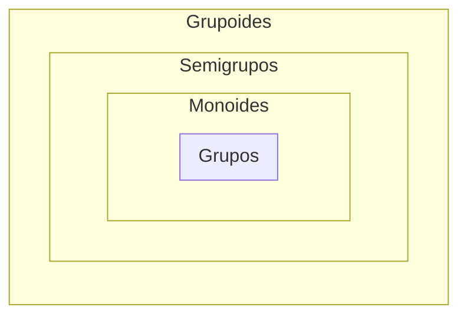

# Elementos da teoria de grupos — Aula 2 (17/09)

> [!info] Curiosidade
> Existem **mais de $1.8 \times 10^9$** semigrupos de ordem $\leq 8$.
> Existem, **exatamente**, **14** grupos de ordem $\leq 8$.

## 1. Exemplos de grupos, por ordem

$\textbf{Exemplo}$ (grupos)
- **Ordem 1** — chama-se $\mathbb{Z}_1$:

  |     | $0$ |
  | --- | --- |
  | $0$ | $0$ |

- **Ordem 2** — chama-se $\mathbb{Z}_2$, é o mod $2$:

  |     | $0$ | $1$ |
  | --- | --- | --- |
  | $0$ | $0$ | $1$ |
  | $1$ | $1$ | $0$ |

- **Ordem 3** — $\mathbb{Z}_3$:

  |     | $0$ | $1$ | $2$ |
  | --- | --- | --- | --- |
  | $0$ | $0$ | $1$ | $2$ |
  | $1$ | $1$ | $2$ | $0$ |
  | $2$ | $2$ | $0$ | $1$ |

## 2. Elemento neutro

> [!quote] Ideia central
> Em todo grupo há sempre um **elemento neutro**, ou seja, um elemento que, operado com outro elemento, resulta no outro.

$\textbf{Definição}$. Seja $(G, *)$ um grupóide.
- Um elemento $e \in G$ diz-se um elemento **neutro à esquerda** se $\forall a \in G,\; e*a = a$.
- Um elemento $e \in G$ diz-se um elemento **neutro à direita** se $\forall a \in G,\; a*e = a$.
- Um elemento de $G$ diz-se **neutro** se é simultaneamente neutro à esquerda e à direita.

> [!info] **Proposição**
> Se um grupóide $(G,*)$ tem um elemento neutro à esquerda $l \in G$ e tem um elemento neutro à direita $r \in G$, então $l = r$.

> [!check]- **Demonstração**
> Tem-se
> $$l = l * r = r$$
> onde a primeira igualdade usa que $r$ é neutro **à direita** (aplicado a $l$), e a segunda usa que $l$ é neutro **à esquerda** (aplicado a $r$). $\blacksquare$

> [!warning] Nota
> O elemento neutro também é chamado de **identidade**, em linguagem multiplicativa.

$\textbf{Corolário}$. Um grupóide tem **no máximo um** elemento neutro (ou identidade).

## 3. Monóide

$\textbf{Definição}$. Um **monóide** é um semigrupo com identidade.

$\textbf{Exemplo}$
1. $(\mathbb{N}, +)$ **não** é monóide — falta o elemento neutro em $\mathbb{N} = \{1,2,\dots\}$ (se $\mathbb{N}$ não inclui o $0$).
2. $(\mathbb{N}_0, +)$, $(\mathbb{Z}, +)$, $(\mathbb{N}, \cdot)$ são monóides.
3. $\mathcal{M}_{n\times n}(\mathbb{R})$ (matrizes reais $n \times n$, com a multiplicação) é um monóide — o elemento neutro é a **matriz identidade**.
4. $\mathcal{F}(X)$ (funções no conjunto $X$, com a composição) é um monóide — o elemento neutro é a **função identidade** $\text{id}_X$.
5. $(\mathcal{P}(A), \cup)$ e $(\mathcal{P}(A), \cap)$ são monóides:
   - o elemento neutro para $\cup$ é o **conjunto vazio**;
   - o elemento neutro para $\cap$ é o **próprio conjunto** $A$.
6. As matrizes reais $n\times n$ com determinante $0$ **não** formam um monóide (é um semigrupo, mas sem identidade).
7. As funções constantes num conjunto com mais de um elemento **não** formam um monóide — todos os elementos são neutros à **direita**, mas nenhum é neutro (à esquerda).
8. $(\mathbb{N}, *)$ com $a*b=|a-b|$ admite elemento neutro ($0$), mas **não** é monóide — porque nem sequer é semigrupo (a operação não é associativa).

> [!info] Nota
> Se $M$ é um monóide com elemento neutro $e$, então $e^n = e$ para todo $n \geq 1$ (indução simples).
>
> Convenção prática: na tabela de Cayley de um grupóide finito **com** elemento neutro, costuma ordenar-se os elementos de modo que o elemento neutro seja o primeiro.

