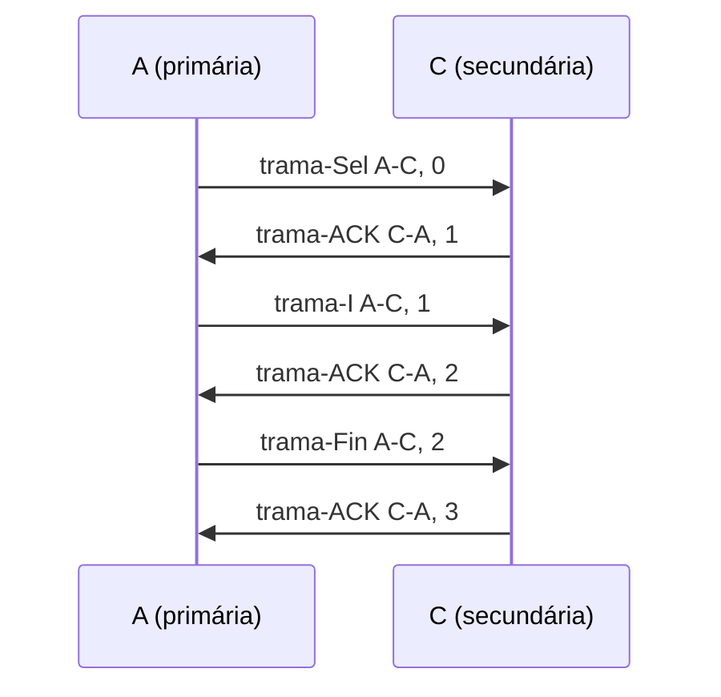
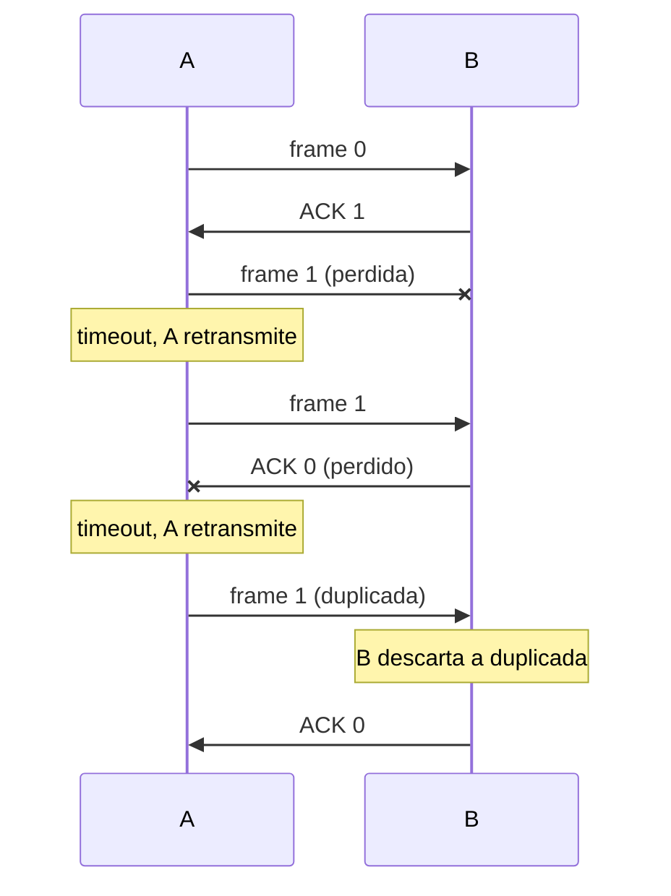

# Controlo da Ligação de Dados

# 1. Introdução

## 1.1 Ideia central

- A existência de ligações físicas e a transmissão de sinais (analógicos ou digitais), **por si só, não garantem** a comunicação de dados entre entidades residentes em estações diferentes.
- São necessárias **regras** que definam como se faz a transferência dos dados: o **protocolo de comunicação**.
- A troca de dados deve ser regulada para criar um **contexto comum** e um **sincronismo** entre as entidades.

As regras definem, por exemplo: como os dados se organizam, quem pode transmitir e quando, como se identificam origem e destino, como se confirma a receção, como se tratam os erros e como se inicia e termina uma ligação lógica.

> [!abstract] Definição
> Os **protocolos de ligação lógica** (ou **ligação de dados**) constituem o primeiro nível de **troca ordenada, controlada e fiável** de dados entre sistemas interligados por meio de uma ligação física.

## 1.2 Modelos OSI e IEEE 802

No modelo **OSI**, a camada de **Ligação** fica acima da **Física**.

No modelo **IEEE 802** (redes locais), a camada de ligação divide-se em duas subcamadas:

| Subcamada | Funções típicas | Norma |
|---|---|---|
| **LLC** (*Logical Link Control*) | Interface com as camadas superiores através do **LSAP** (*LLC Service Access Point*); controlo lógico da ligação | IEEE 802.2 |
| **MAC** (*Medium Access Control*) | Acesso ao meio físico; endereçamento físico; controlo de quem transmite num meio partilhado | IEEE 802.3 (Ethernet), IEEE 802.11 (Wi-Fi) |

## 1.3 Nível físico vs nível de ligação lógica

| Nível físico | Nível de ligação lógica |
|---|---|
| Envio de um sinal sobre um meio de transmissão | Estrutura das tramas |
| Sincronismo (ao nível do bit) | Configuração e acesso à linha |
| Codificação de linha | Endereçamento |
| Modulação do sinal | Controlo de fluxo |
| Multiplexagem física | Controlo de erros |
| Interface com o meio | Gestão da ligação (controlo da troca de dados) |

Em resumo: a unidade do nível físico é o **bit**; a do nível de ligação é a **trama**.

## 1.4 Principais funções de um protocolo de ligação

1. **Definição da trama**: formato da unidade de dados (**PDU**, *Protocol Data Unit*).
2. **Configuração da linha**: considera a topologia, define a disciplina de acesso à linha e a sua duplexidade.
3. **Endereçamento**: identifica os interfaces das estações que podem enviar e receber tramas.
4. **Controlo de fluxo**: regula a cadência de tramas enviadas.
5. **Controlo de erros**: deteta erros de transmissão e executa procedimentos de recuperação.
6. **Gestão da ligação**: define como se faz o estabelecimento, a manutenção e a terminação da associação lógica.

---

# 2. Definição da trama

Cada protocolo define o **formato da PDU**, bem como os **valores, o significado e o comprimento** dos seus campos.

## 2.1 Exemplo de formato e semântica

```
| Endereço destino | Endereço origem | tipo | número |      Dados      | CRC |
|<-- Campo do endereço -->|<- Campo de controlo ->|<- Campo de informação ->|<- Controlo de erros ->|
```

**Valores do campo de endereço** (exemplo): `0001 = A`, `0010 = B`, `0011 = C`, `0100 = D`...

**Valores do campo de tipo** (exemplo):

| Código | Tipo de trama | Função |
|---|---|---|
| `100` | **trama-I** | Transporta informação |
| `001` | **trama-ACK** | Confirma |
| `010` | **trama-NAK** | Rejeita |
| `001` | **trama-Poll** | Cede controlo |
| `000` | **trama-Select** | Estabelece ligação |
| `011` | **trama-Fin** | Termina ligação |

> [!warning] Gralha nos slides
> No slide, tanto a trama-ACK como a trama-Poll aparecem com o código `001`. Deve ser um erro do slide, porque o mesmo código não pode identificar dois tipos diferentes. Convém confirmar com o professor.

As tramas **ACK, NAK, Poll, Select e Fin** são **tramas de controlo**.

## 2.2 Tramas de controlo

As tramas de controlo **não possuem campo de dados**, portanto são **tramas curtas**.

**Exemplo: trama-Select** (`trama-Sel C, A, 0`):

```
 Destino (C) | Origem (A) | tipo (Sel) | número (0) | CRC
   0 0 1 1   |   0 0 0 1  |   0 0 0    |   0 0 0    | 1 0
```

Nesta definição protocolar:
- Nas **tramas de resposta** (ACK e NAK), o campo **número** confirma a receção no sentido oposto da **trama número − 1**.
- Nas restantes tramas, o **número** é a **numeração de sequência** da própria trama.

---

# 3. Protocolos (disciplinas) de linha

## 3.1 Tipos de estações

| Estação | Papel |
|---|---|
| **Primária** | Faz a **gestão da ligação** (relação 1:n); envia **tramas de comando** |
| **Secundária** | Está **sob controlo da primária**; envia **tramas de resposta** |
| **Mista** | **Partilha o controlo** da ligação com outra do mesmo tipo (pode comportar-se como primária ou como secundária) |

## 3.2 Fases de uma ligação lógica

| Fase | Tramas | Exemplos de respostas |
|---|---|---|
| **1) Estabelecimento da ligação** | `trama-Sel` | `noReply`, `trama-ACK`... |
| **2) Transferência de dados** | `tramas-I` | `tramas-ACK`, `trama-NAK`... |
| **3) Terminação** | `trama-Fin` | `trama-ACK`, `noReply`... |

Em geral, estas fases de controlo (não necessariamente todas) estão presentes em protocolos de linha **PP** e **MP**.

## 3.3 Ligações ponto-a-ponto e multiponto

**Ponto-a-ponto (PP)**
- Em geral, um canal para transmissão em cada sentido.
- Canal **dedicado** (não partilhado), logo a ligação lógica pode efetuar-se **imediatamente**, porque o canal está naturalmente *adquirido*.

**Multiponto (MP)**
- Em geral, um **único canal partilhado** por várias estações.
- A ligação lógica tem de ser **precedida pela aquisição do canal** através de um **protocolo de acesso ao meio (protocolo MAC)**.

## 3.4 Protocolos MAC (para ligações MP)

| Tipo | Funcionamento |
|---|---|
| **Poll/Select** | A estação **primária** passa o controlo a uma estação secundária (**poll**), ficando esta autorizada a **selecionar** outra estação para enviar dados. É um esquema centralizado e sem transmissões simultâneas descontroladas. |
| **Contencioso** | Todas as estações são **mistas** (primárias e secundárias). Duas ou mais podem transmitir em simultâneo, originando **colisões** de tramas que terão de ser **retransmitidas**. Existe **contenção para a aquisição do meio**. |

> [!warning] Em meios partilhados
> O problema central é decidir **quem pode transmitir** e **o que fazer se houver colisão**.

## 3.5 Exemplo: Poll/Select

Estações A, B, C, D, E. **A é a primária** e as restantes são secundárias. A seleciona C para lhe enviar dados, ou seja, **A estabelece uma ligação lógica com C**.



- $t_{prop}$ = tempo de propagação entre A e C.
- $t_{trama}$ = tempo de transmissão da trama-I.

## 3.6 Endereçamento

- **Característica comum a todas as ligações multiponto**: necessidade de endereçamento.
  - Tanto em Poll/Select como em protocolos contenciosos é preciso o **endereço das estações envolvidas**.
- Numa ligação **PP** não é necessário endereçamento nas tramas, embora seja usado para dar **generalidade** ao protocolo.
- Designações comuns: **endereço Ethernet, endereço MAC, endereço hardware**... (ver módulo 3).

---

# 4. Controlo de fluxo

Técnica para assegurar que a estação que transmite **não sobrecarrega** a que recebe, evitando perda de tramas.

- A existência de *buffers* na estação recetora **reduz mas não elimina** a necessidade de controlar o fluxo.
- A perda de tramas pode ocorrer também nas **redes de interligação**, quando estas estão congestionadas nalgum ponto do percurso.

**Técnicas mais comuns**: *stop-and-wait* e *sliding window* (janela deslizante).

## 4.1 Stop-and-Wait (Pára-e-Espera)

- Após a transmissão de uma trama, a fonte **aguarda a confirmação (ACK)** antes de transmitir a trama seguinte.
- O recetor pode **parar o fluxo** suspendendo temporariamente as confirmações.

```
A -> B : trama 0
B -> A : ACK 1
A -> B : trama 1
B -> A : ACK 0
```

- Funciona bem quando uma mensagem é fragmentada em **poucas tramas de grande dimensão**.
- Mas, se as tramas são grandes: é **maior a probabilidade de erro** na trama e é **maior a ocupação de recursos** (buffers, processadores).
- Vantagem: simples e exige pouca memória. Desvantagem: **baixa eficiência** (o emissor passa muito tempo à espera, sobretudo com grande atraso de propagação).

## 4.2 Sliding Window (Janela Deslizante)

- Permite **múltiplas tramas de dados em trânsito**.
- O transmissor pode enviar até **$W$ tramas** sem receber qualquer confirmação.
- Obriga ao uso de **sequenciação**: $n$ bits, numeração em **módulo $2^n$**.
- Cada confirmação positiva indica a **próxima trama esperada**.
- Pode haver **confirmação simultânea** (cumulativa) de várias tramas.
- Existem **mecanismos distintos** para transmitir e receber (janela de emissão e janela de receção).

$W$ é designado **abertura da janela**:

| Mecanismo | Janela máxima |
|---|---|
| **Go-back-N** | $W_{max} = 2^n - 1$ |
| **Selective Reject** | $W_{max} = 2^{n-1}$ |

> [!example] Numeração com $n = 3$
> Módulo $2^3 = 8$, números de sequência $0, 1, 2, 3, 4, 5, 6, 7$ (depois do 7 volta ao 0).
> - Go-back-N: $W_{max} = 2^3 - 1 = 7$
> - Selective Reject: $W_{max} = 2^{3-1} = 4$

### Funcionamento da janela

Na **perspetiva do transmissor**:
- Tramas já transmitidas e confirmadas ficam para trás.
- Tramas enviadas mas ainda não confirmadas ficam em *buffer* até serem confirmadas.
- A janela é o conjunto de tramas que **podem ser transmitidas**.
- A janela **encolhe pelo lado esquerdo** à medida que as tramas são enviadas e **expande pelo lado direito** à medida que chegam ACKs.

Na **perspetiva do recetor**:
- A janela é o conjunto de tramas que **podem ser aceites**.
- Encolhe quando as tramas são recebidas e expande quando os ACKs são enviados.

**Exemplo dos slides** (janela deslizante com $n = 3$ e $W = 7$): o transmissor envia F0, F1, F2; o recetor responde com **RR 3** (próxima esperada é a 3); o transmissor envia F3, F4, F5, F6 e, entretanto, chega **RR 4**; a janela vai deslizando a cada confirmação.

## 4.3 Utilização da ligação

A utilização (rendimento) da ligação depende de $W$ e do parâmetro $a$.

### Parâmetro $a$

Razão entre o **tempo de propagação** e o **tempo de transmissão** da trama:

$$a = \frac{t_{prop}}{t_{trama}} = \frac{d/v}{L/r} = \frac{r \cdot d}{v \cdot L}$$

| Símbolo | Significado | Unidade |
|---|---|---|
| $d$ | distância entre estações | m |
| $v$ | velocidade de propagação | m/s |
| $L$ | comprimento da trama | bits |
| $r$ | ritmo de transmissão | bps |

> [!tip] Interpretação
> Normalizando $t_{trama} = 1$, tem-se $t_{prop} = a$.
> - $a < 1$: a trama demora mais a ser transmitida do que a propagar-se. O emissor ainda está a transmitir quando o início da trama já chegou ao recetor.
> - $a > 1$: o sinal demora mais a propagar-se do que a trama a ser emitida. A trama já saiu toda do emissor e ainda está a "viajar".

### Stop-and-Wait

A **utilização** é a fração do tempo total que é útil (usada a transferir tramas de dados), $U = t_{util} / t_{total}$.

Num ciclo, o emissor transmite durante $1$ (tempo da trama) e o ACK só chega ao fim de $1 + 2a$ (ida e volta). Logo:

- $a$ pequeno: Stop-and-Wait é aceitável.
- $a$ grande: o emissor espera muito pelo ACK, logo a utilização é baixa.

### Janela deslizante (ligação full-duplex entre A e B)

| Caso | Condição | Utilização |
|---|---|---|
| **Caso 1**: o ACK da trama 1 chega **antes** de a janela fechar, logo A transmite continuamente | $W \ge 2a + 1$ | $U = 1$ |
| **Caso 2**: a janela **fecha** antes de chegar o primeiro ACK (em $t_0 + 2a + 1$) | $W < 2a + 1$ | $U = \dfrac{W}{2a + 1}$ |

## 4.4 Exemplos resolvidos

### Exemplo 1: rede LAN

Dados: $d = 10\ km = 10^4\ m$, $v = 2 \times 10^8\ m/s$, $L = 1000$ bits, $r = 10\ Mbps$.

**Exercício 1: calcular $a$**

$$a = \frac{r \cdot d}{v \cdot L} = \frac{10 \times 10^6 \times 10^4}{2 \times 10^8 \times 1000} = \frac{10^{11}}{2 \times 10^{11}} = 0{,}5$$

**Exercício 2: que ritmo $r$ dá 80% de utilização com stop-and-wait?**

$$U = 0{,}8 = \frac{1}{1 + 2a} \;\Rightarrow\; 1 + 2a = 1{,}25 \;\Rightarrow\; a = 0{,}125$$

$$r = \frac{a \cdot v \cdot L}{d} = \frac{0{,}125 \times 2 \times 10^8 \times 1000}{10^4} = 2{,}5 \times 10^6\ bps$$

**$r = 2{,}5\ Mbps$** (coincide com a solução dos slides).

### Exemplo 2: rede WAN com ATM

Dados: $d = 1000\ km = 10^6\ m$, $v = 2 \times 10^8\ m/s$, $L = 424$ bits, $r = 155\ Mbps$.

**Exercício 1: calcular $a$**

$$a = \frac{155 \times 10^6 \times 10^6}{2 \times 10^8 \times 424} = \frac{1{,}55 \times 10^{14}}{8{,}48 \times 10^{10}} \approx 1827{,}8$$

**Exercício 2: que janela $W$ dá 50% de utilização?**

Como $a$ é muito grande, estamos no caso $W < 2a + 1$:

$$U = \frac{W}{2a + 1} = 0{,}5 \;\Rightarrow\; W = 0{,}5 \times (2 \times 1827{,}8 + 1) \approx 1828{,}3$$

Como $W$ tem de ser inteiro e queremos **pelo menos** 50%, escolhe-se **$W = 1829$**.

> [!warning] Diferença face aos slides
> Os slides indicam $W = 1825$. Com a fórmula dos próprios slides o resultado é cerca de **1828,3**. Com $W = 1825$ a utilização seria $1825 / 3656{,}7 \approx 49{,}9\%$. A diferença deve vir de arredondamentos ou de uma gralha. Num exame, mostra o cálculo e o resultado exato.

---

# 5. Controlo de erros

Envolve a **deteção de falhas** nas tramas trocadas, de modo a tornar a ligação de dados **fiável**.

**Tipos de falhas**
- **Trama perdida**: não chega ao destino (erro no meio, colisão, congestionamento, descarte...).
- **Trama errada**: chega com bits corrompidos (detetada, por exemplo, com **CRC**).

## 5.1 ARQ (Automatic Repeat reQuest)

As técnicas de controlo de erros são do tipo **ARQ**. Processa-se de forma **automática e contínua**, sem intervenção do utilizador, e envolve:

- **Deteção de erros** na trama recebida através do **CRC**.
- **Confirmação positiva** (ACK): para tramas recebidas sem erros.
- **Confirmação negativa** (NAK/REJ) **e retransmissão**: para tramas onde é detetado erro.
- **Retransmissão por limite de tempo** (*timeout*): se não é recebida confirmação dentro do período de tempo $t$.

**Métodos ARQ**: *Stop-and-Wait* (pára-e-espera), *Go-back-N* (volta-atrás-N) e *Selective Reject* (rejeição seletiva).

## 5.2 Stop-and-Wait ARQ (Idle RQ)

Usado com a técnica de controlo de fluxo *stop-and-wait*.

**Transmissor**
- Ativa um **temporizador** e **mantém cópia** da trama até obter ACK.
- No máximo espera o *timeout* e depois transmite de novo.

**Recetor**
- Envia **ACK**, **NAK** (pedido explícito) ou **no reply** (pedido implícito, que leva ao timeout do emissor).

**Sequenciação necessária** para resolver o erro na trama de confirmação (**duplicação da trama**).



> [!example] Porque é que a numeração é necessária
> A envia a trama 0. B recebe-a e envia ACK. O ACK perde-se. A faz *timeout* e retransmite a trama 0. Sem numeração, B aceitaria a mesma trama duas vezes. Com numeração, B reconhece que é duplicada e **descarta-a** (mas volta a confirmar).

**Vantagem**: simples. **Desvantagem**: reduzida eficiência.

## 5.3 Go-back-N (volta-atrás-N)

- Usado com **janela deslizante**.
- A falta de sequenciação ou um erro na receção implica a **retransmissão a partir de uma determinada trama**.

**Trama $i$ corrompida ou perdida**
- Ao receber a trama $i+1$, o recetor deteta que falta a $i$ e gera um **REJ $i$**.
- O emissor tem de retransmitir a trama $i$ **e todas as seguintes**.
- Se o recetor não recebeu mais nenhuma trama, o emissor fica sem resposta e recorre ao **timeout**: envia uma trama **RR** (*Receiver Ready*) com **bit P = 1**, obrigando o recetor a confirmar a próxima trama de que está à espera. O recetor responde com **RR $i$**.

**Confirmações perdidas**
- O recetor recebe a trama $i$ e envia **RR $i+1$**, que se perde.
- As **confirmações são cumulativas**: qualquer confirmação posterior pode confirmar a trama $i$. Por exemplo, a receção da trama $i+1$ e o envio de **RR $i+2$** confirmam também a $i$.
- Se não houver receções posteriores, o *timeout* obriga o emissor a pedir confirmação do estado ao recetor.

**Rejeições perdidas**: mecanismos de recuperação semelhantes aos anteriores.

> [!example] Exemplo ilustrativo
> A envia 0, 1, 2, 3, 4, 5. B deteta erro na trama 3 e envia REJ 3. As tramas seguintes são descartadas pelo recetor. A retransmite 3, 4, 5.

## 5.4 Selective Reject (rejeição seletiva)

- Alternativa possível na **janela deslizante**.
- **Apenas são retransmitidas** as tramas que recebem confirmação negativa explícita (**SREJ**) ou em que ocorre *timeout*.
- Tramas posteriormente transmitidas e corretamente recebidas **não têm de ser retransmitidas**.
- $W_{max}$ mais restritivo, para **não sobrepor as janelas** de transmissão e de receção:

> [!important] Atenção
> $W_{max} = 2^{n-1}$ e **não** $W_{max} = 2^n - 1$.

- **Vantagem**: menos retransmissões, melhor utilização da ligação.
- **Desvantagem**: requer mais processamento (e controlo) na transmissão e na receção.

**A ordem das tramas na receção não é mantida**, logo:
- O recetor tem de **guardar as tramas recebidas após a rejeição** (*buffer*).
- **Receptor**: inserção de tramas fora de sequência, reordenando antes de entregar à camada superior.
- **Emissor**: emissão de tramas fora de sequência.

## 5.5 Go-back-N vs Selective Reject

| Critério | Go-back-N | Selective Reject |
|---|---|---|
| Retransmissão | A trama errada **e todas as seguintes** | **Apenas** a trama errada |
| Confirmação negativa | `REJ` | `SREJ` |
| Janela máxima | $2^n - 1$ | $2^{n-1}$ |
| Recetor | Mais simples (descarta tramas fora de ordem) | Mais complexo (guarda e reordena) |
| Memória no recetor | Menor | Maior |
| Utilização da ligação | Pior em caso de erro | Melhor |
| Uso | **Mais usado** | Menos usado |

> [!note]
> O **Go-back-N é mais usado** do que a rejeição seletiva porque, apesar de conduzir a uma pior utilização da ligação, **reduz a complexidade do recetor**.

## 5.6 Interpretar o diagrama do exemplo dos slides

Os slides apresentam duas figuras lado a lado (a) Go-back-N e (b) Selective-reject, com as perguntas: *duplexidade da ligação? controlo de fluxo? controlo de erros? nº de bits de numeração e módulo? tamanho de janela máximo e negociado?*

| Pergunta | Resposta (a partir das figuras) |
|---|---|
| Duplexidade | **Full-duplex** (tramas de dados e RR cruzam-se em simultâneo) |
| Controlo de fluxo | **Janela deslizante** |
| Controlo de erros | **ARQ**: Go-back-N em (a), Selective Reject em (b) |
| Nº de bits / módulo | As tramas vão de 0 a 7, logo $n = 3$ e módulo $= 8$ |
| Janela máxima | Go-back-N: $2^3 - 1 = 7$. Selective Reject: $2^{3-1} = 4$ |
| Janela negociada | Valor acordado entre as duas estações (tem de ser $\le W_{max}$) |

**O que acontece nas figuras**
- Em (a): a trama 4 perde-se; ao receber a 5 e a 6, B responde com **REJ 4**, descarta as seguintes, e A retransmite **4, 5 e 6**. Mais à frente há um *timeout* e A envia **RR (P bit = 1)**.
- Em (b): a trama 4 perde-se; B responde com **SREJ 4** e guarda (*buffer*) as seguintes. A retransmite **apenas a 4**.

---

# Fórmulas importantes

| Conceito | Fórmula |
|---|---|
| Parâmetro $a$ | $a = \dfrac{t_{prop}}{t_{trama}} = \dfrac{r \cdot d}{v \cdot L}$ |
| Utilização (Stop-and-Wait) | $U = \dfrac{1}{1 + 2a}$ |
| Utilização (janela), $W \ge 2a + 1$ | $U = 1$ |
| Utilização (janela), $W < 2a + 1$ | $U = \dfrac{W}{2a + 1}$ |
| Módulo de numeração | $2^n$ |
| Janela máxima Go-back-N | $W_{max} = 2^n - 1$ |
| Janela máxima Selective Reject | $W_{max} = 2^{n-1}$ |

---

# Resumo para exame

- Uma ligação física **não basta**: é preciso um **protocolo**.
- A camada de ligação organiza a comunicação em **tramas** (a PDU). Em IEEE 802 divide-se em **LLC** e **MAC**.
- Funções do protocolo de ligação: **trama, configuração da linha, endereçamento, controlo de fluxo, controlo de erros, gestão da ligação**.
- Ligações **PP**: canal dedicado. Ligações **MP**: canal partilhado, exigem **endereçamento** e **protocolo MAC** (**Poll/Select** ou **contencioso**).
- **Controlo de fluxo**: *stop-and-wait* (simples, ineficiente) vs *janela deslizante* (várias tramas em trânsito).
- O parâmetro **$a$** compara propagação com transmissão e determina a eficiência.
- **ARQ** trata erros com **CRC + ACK/NAK + timeout**.
- **Go-back-N** retransmite a partir da errada. **Selective Reject** só a errada, mas é mais complexo.
- $W_{max}$: GBN $= 2^n - 1$, SR $= 2^{n-1}$.

## Perguntas rápidas

> [!question]- Porque é que uma ligação física não garante comunicação de dados?
> Porque faltam regras para organizar a transferência, identificar origem e destino, controlar o acesso, confirmar a receção e recuperar de erros.

> [!question]- O que é uma trama?
> É a unidade de dados da camada de ligação (a PDU). Pode conter endereços, campos de controlo, dados e CRC.

> [!question]- Qual é a diferença entre nível físico e nível de ligação?
> O nível físico transmite bits como sinais. O nível de ligação organiza esses bits em tramas e controla a troca de dados (endereçamento, fluxo, erros, gestão da ligação).

> [!question]- Porque é necessário endereçamento em ligações multiponto?
> Porque várias estações partilham o mesmo meio e é preciso indicar a quem se destina cada trama e quem a enviou.

> [!question]- Qual é a diferença entre Poll/Select e protocolos contenciosos?
> No Poll/Select há uma estação primária que controla o acesso ao meio. No contencioso todas as estações são mistas e competem pelo meio, podendo haver colisões.

> [!question]- O que faz o controlo de fluxo?
> Evita que o emissor envie tramas mais depressa do que o recetor consegue processar, prevenindo perdas.

> [!question]- Qual é a diferença entre Stop-and-Wait e Sliding Window?
> No Stop-and-Wait o emissor envia uma trama e espera pelo ACK. Na janela deslizante pode enviar até $W$ tramas antes de receber confirmações.

> [!question]- Porque é que o Stop-and-Wait tem baixa utilização quando $a$ é grande?
> Porque $U = 1/(1+2a)$: o emissor passa quase todo o tempo à espera do ACK, durante o tempo de propagação de ida e volta.

> [!question]- Qual é a diferença entre Go-back-N e Selective Reject?
> No Go-back-N retransmite-se a trama com erro e todas as seguintes. Na rejeição seletiva retransmite-se apenas a trama com erro.

> [!question]- Porque é que o Go-back-N é mais usado?
> Porque reduz a complexidade do recetor (não precisa de guardar tramas fora de ordem), apesar de usar pior a ligação.

> [!question]- Porque é que o $W_{max}$ da rejeição seletiva é $2^{n-1}$?
> Para evitar a sobreposição entre as janelas de transmissão e de receção, que causaria ambiguidade entre tramas antigas e novas com o mesmo número de sequência.

## Mapa mental

```text
Controlo da Ligação de Dados
├── Protocolo de comunicação
│   ├── Regras
│   ├── Contexto comum
│   └── Sincronismo
├── Camada de ligação
│   ├── LLC (802.2, LSAP)
│   └── MAC (802.3, 802.11)
├── Funções
│   ├── Definição da trama (PDU)
│   ├── Configuração da linha
│   ├── Endereçamento
│   ├── Controlo de fluxo
│   ├── Controlo de erros
│   └── Gestão da ligação
├── Protocolos de linha
│   ├── Estações: primária, secundária, mista
│   ├── Ponto-a-ponto
│   └── Multiponto
│       ├── Poll/Select
│       └── Contencioso
├── Controlo de fluxo
│   ├── Stop-and-Wait  (U = 1/(1+2a))
│   └── Janela deslizante
│       ├── W, módulo 2^n
│       ├── ACK cumulativo
│       └── U = 1 ou W/(2a+1)
└── Controlo de erros (ARQ)
    ├── Stop-and-Wait (idle RQ)
    ├── Go-back-N  (Wmax = 2^n - 1)
    └── Selective Reject  (Wmax = 2^(n-1))
```

# Links
- [[LCC-SCR-2_unlocked.pdf]]
